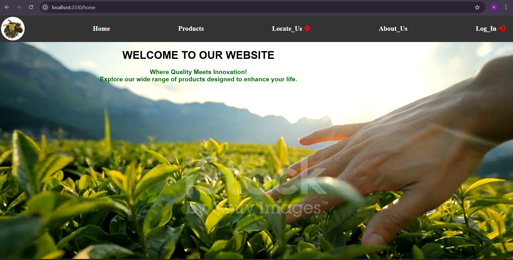
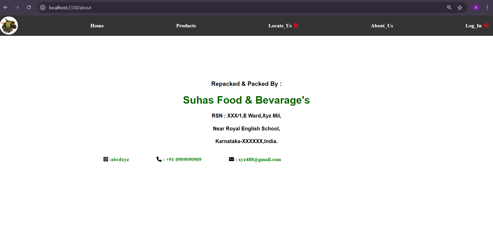
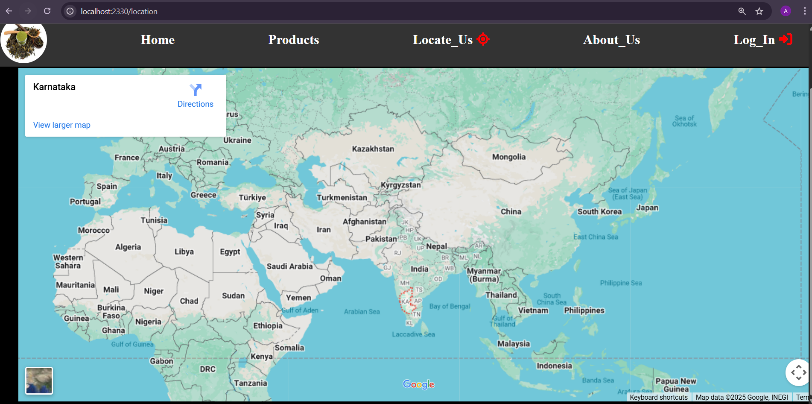
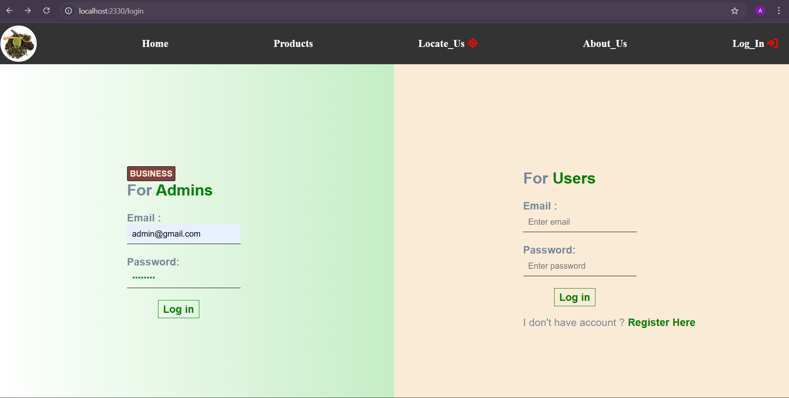
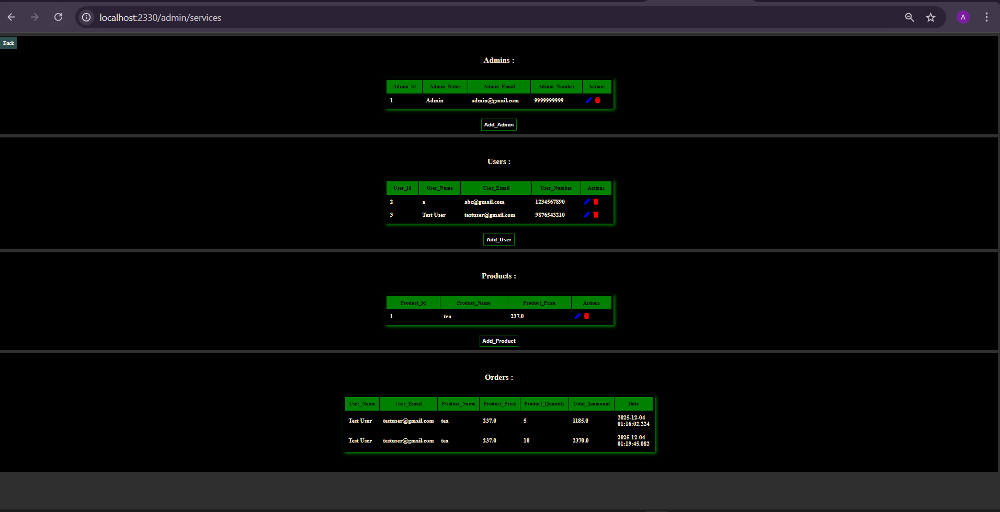
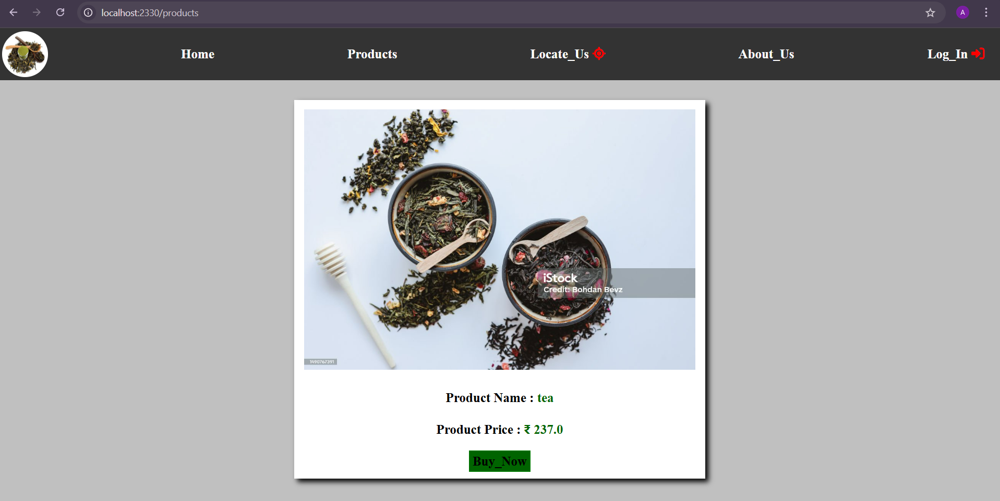
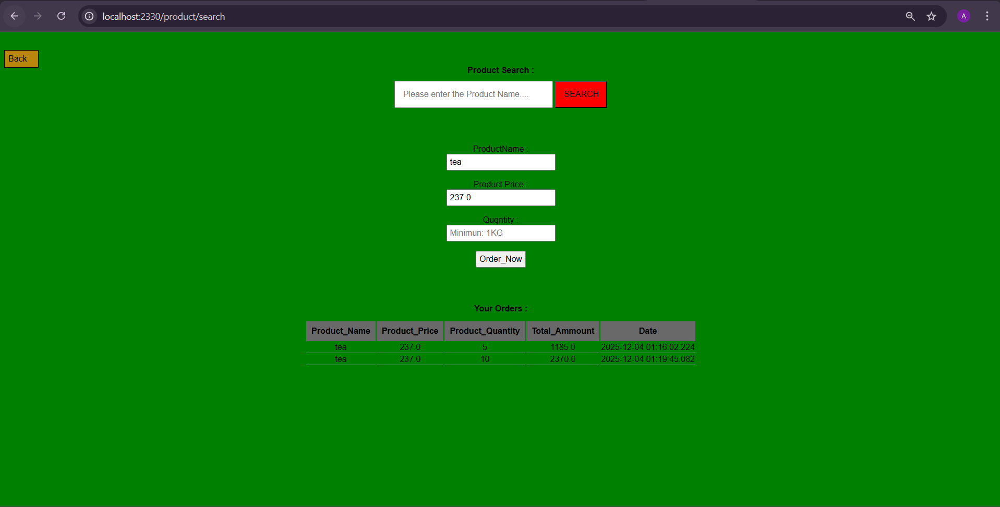
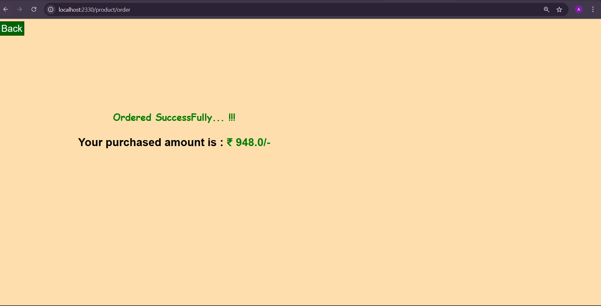
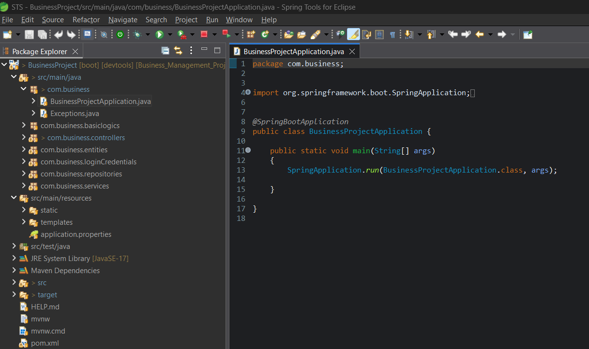

A full-stack Java Spring Boot + Thymeleaf + MySQL business management web application that allows Admin and Users to manage products, browse inventory, place orders, and view business information.

This project demonstrates end-to-end development, including backend APIs, UI templates, database integration, and admin-level CRUD operations.

🚀 Features
👤 User Features

View business homepage

Explore products

Search for items

Place orders

View locations

Read about the business

🧑‍💼 Admin Features

Add / Edit / Delete products

Manage users

Manage orders

Access Admin Dashboard

Control full system operations

🛠 Tech Stack

Java 17

Spring Boot 3.1.3

Maven

MySQL

Thymeleaf

HTML5, CSS3

📁 Project Overview with Screenshots

Below are the screenshots demonstrating the application flow and UI pages.

## 🏠 Home Page  

---

## ℹ️ About Page  

---

## 📍 Location Page  

---

## 🔐 Login Page  

---

## 🧑‍💼 Admin Services / Dashboard  

---

## 🛒 Products Page  

---

## 🔍 Product Search Page  

---

## 🛍️ Product Ordering Page  

---

## 🧩 Project Code Structure (Backend View)  

⚙️ Setup Instructions
1️⃣ Clone the Repository
git clone https://github.com/YOUR_USERNAME/YOUR_REPO.git
cd YOUR_REPO

2️⃣ Setup MySQL
CREATE DATABASE businessproject;

Update DB credentials inside:

src/main/resources/application.properties

3️⃣ Insert Admin Credentials
INSERT INTO admin (admin_email, admin_name, admin_number, admin_password)
VALUES ('admin@gmail.com', 'Admin', '9999999999', 'admin123');

4️⃣ Run the Application
mvn spring-boot:run

Runs at:
👉 http://localhost:2330/
